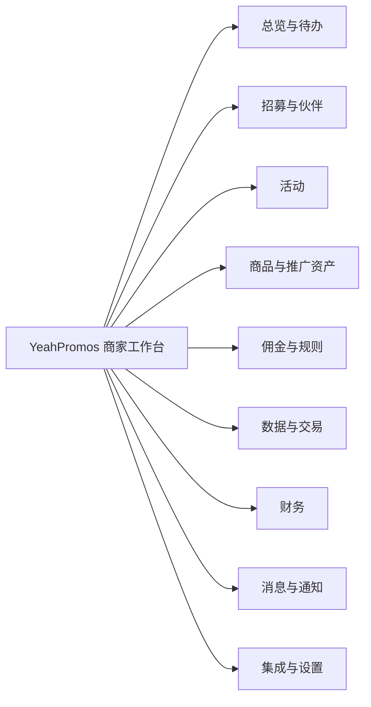

# YeahPromos 商家端产品框架

> Merchant-side product framework · v0.2 · 待业务评审

本仓库当前只定义 **站内产品框架**：栏目、页面职责、功能、字段、状态、权限、流程分支和验收边界。它不是桌面 Demo，不包含视觉风格、高保真页面、前端工程或后端实现。

## 对当前方法的专业判断

先确认功能框架，再基于同一框架做不同视觉风格，是正确顺序。它能避免团队在高保真阶段反复争论“页面是否还缺功能”，也能让不同风格方案在相同任务、相同数据和相同状态下公平比较。

但“框架”不能只是一张站点地图。一个可用于后续设计和研发的框架，至少要同时冻结五件事：

1. **用户任务**：商家为什么进入这个栏目，要完成什么结果。
2. **信息与字段**：每个页面必须展示、收集和导出的信息。
3. **状态与分支**：对象从哪里来，经过什么状态，失败或无权限时怎么办。
4. **角色与数据边界**：不同账号、品牌和团队成员能看什么、改什么。
5. **验收与证据**：每项需求来自哪张素材，哪些只是待确认建议。

本仓库按这五层组织，因此后续高保真方案只需改变视觉语言与交互表达，不应各自发明一套功能。

## 本轮范围

### 包含

- 商家站内全局导航、账户与品牌上下文
- Amazon 商家新增站点、品牌资料、项目参数、店铺授权与商品启用
- 伙伴发现、邀请、申请审核、伙伴关系与分组
- 活动入口及其与伙伴、素材、数据的站内关系
- 商品、优惠券、佣金规则、邮件模板等推广资产
- 绩效、品牌、交易、Amazon BRB 等站内报表
- 余额、充值、账单与发票
- 团队账号、品牌范围、模块权限与站内设置
- 加载、空、错误、校验、权限、同步等必要产品状态

### 不包含

- 任何视觉风格、高保真页面或前端代码
- 商家站外官网、营销落地页或招募页的视觉设计
- Amazon Attribution 等第三方后台自身的页面
- 后端、数据库、真实支付、消息发送或第三方 API 实现
- 素材中只出现菜单名称、但没有足够页面证据的详细业务规则

## 证据与需求标签

| 标签 | 含义 | 如何处理 |
|---|---|---|
| `C · Confirmed` | 65 张素材（40 张原框架证据 + 25 张 Amazon 入驻补充证据）中直接展示 | 进入框架基线 |
| `R · Referenced` | 只在菜单、入口或跳转中出现 | 保留栏目，详细需求待补 |
| `P · Proposed` | 为形成完整站内闭环而提出 | 需业务确认后进入基线 |
| `X · Excluded` | 明确为站外或本阶段不做 | 不进入后续 Demo |

优先级使用 `P0 / P1 / P2`：`P0` 是商家核心闭环，`P1` 是规模化运营必需，`P2` 是扩展能力或证据不足项。

## 建议的信息架构

这里按商家任务组织，而不是照搬旧系统的 `Reports / Partners / Creatives / Tools` 功能堆叠。原功能没有被删除，完整映射见 [信息架构](docs/01-information-architecture.md)。

## 评审入口

建议按以下顺序评审：

1. [方法与产品审计](docs/00-method-and-product-review.md)：本次方法是否成立，旧结构有哪些关键问题。
2. [信息架构](docs/01-information-architecture.md)：栏目、层级与旧功能迁移位置。
3. [完整功能目录](docs/02-functional-catalog.md)：页面内容、字段、动作、状态和优先级。
4. [核心流程与分支](docs/03-core-flows-and-branches.md)：招募、审核、配置、复盘和权限闭环。
5. [领域数据、状态与权限](docs/04-domain-data-states-and-permissions.md)：后续设计和研发共用的产品契约。
6. [素材证据矩阵](docs/05-source-evidence-matrix.md)：65 张文件（40 张原框架 + 25 张 Amazon 入驻补充）逐项对应到功能。
7. [框架确认清单](docs/06-framework-review-checklist.md)：需要你做出的具体决定。
8. [Amazon 商家入驻、站点授权与商品启用](docs/07-amazon-merchant-onboarding-and-products.md)：新增站点到商品同步与充值的完整产品合同。

也可以通过 [GitHub 反馈模板](.github/ISSUE_TEMPLATE/framework-feedback.md) 按模块提交意见。

## 框架冻结后的高保真方法

框架确认后，建议建立一个 `framework-v1` 基线，所有视觉方向都使用：

- 相同页面清单与路由
- 相同字段、状态和权限
- 相同核心任务与测试数据
- 相同桌面/移动断点与验收脚本

不同风格只比较信息层级、布局、品牌表达、组件语言和动效，不通过删减功能来获得“更简洁”的假象。最终选定方向后再进入生产级交互和技术实现。
