# 信息架构

## 1. 设计原则

1. 顶层导航表达商家任务，不表达内部技术模块。
2. 达人与媒体共享招募流程，但保留不同画像与筛选字段。
3. 一个业务对象只有一套状态口径；不同入口只能带入不同预设筛选。
4. 配置项放在它所影响的任务附近，同时在设置中保留集中管理入口。
5. 品牌是全局数据范围，不应在每个页面重复制造另一套品牌逻辑。
6. 站外工具只作为集成对象，不把第三方后台页面纳入本产品导航。

## 2. 建议站点地图

```mermaid
flowchart TD
    APP["YeahPromos 商家工作台"]

    APP --> O["1. 总览与待办"]
    O --> O1["经营概览"]
    O --> O2["待处理事项"]
    O --> O3["最近活动与数据提示"]

    APP --> R["2. 招募与伙伴"]
    R --> R1["伙伴发现"]
    R1 --> R1A["达人发现"]
    R1 --> R1B["媒体发现"]
    R --> R2["邀请中心"]
    R2 --> R2A["单人邀请"]
    R2 --> R2B["批量邀请"]
    R2 --> R2C["邀请历史"]
    R --> R3["申请审核"]
    R --> R4["我的伙伴"]
    R --> R5["伙伴分组"]

    APP --> C["3. 活动"]
    C --> C1["联盟计划"]
    C --> C2["达人活动"]
    C --> C3["活动详情与执行"]

    APP --> A["4. 商品与推广资产"]
    A --> A1["产品库与 Amazon 筛选规则"]
    A --> A2["优惠券"]
    A --> A3["文案与邮件素材"]
    A --> A4["横幅与图片"]

    APP --> U["5. 佣金与规则"]
    U --> U1["佣金规则"]
    U --> U2["归因与优惠券规则"]
    U --> U3["PPC 限制"]
    U --> U4["链接参数"]

    APP --> D["6. 数据与交易"]
    D --> D1["绩效分析"]
    D --> D2["品牌分析"]
    D --> D3["交易明细"]
    D --> D4["交易申诉"]
    D --> D5["Amazon BRB"]
    D --> D6["保存的报告与导出"]

    APP --> F["7. 财务"]
    F --> F1["余额与充值"]
    F --> F2["付款与账单"]
    F --> F3["发票"]

    APP --> M["8. 消息与通知"]
    M --> M1["站内信箱"]
    M --> M2["系统通知"]
    M --> M3["邮件群发"]
    M --> M4["邮件模板"]

    APP --> S["9. 集成与设置"]
    S --> S0["组织与账号详情"]
    S --> S1["品牌与站点"]
    S --> S2["网络、店铺与 Amazon 授权"]
    S --> S3["团队账号与权限"]
    S --> S4["计划、订阅与支付方式"]
    S --> S5["API 与开发者设置"]
    S --> S6["邮件与登录安全"]
```

## 3. 顶层栏目职责

| 新栏目 | 商家要完成的工作 | 主要页面 | 证据成熟度 |
|---|---|---|---|
| 总览与待办 | 判断今天要处理什么，业务是否健康 | 经营概览、申请审核、余额/数据提示 | `C + P`：基础指标与空状态已展示，行动化待办和口径需定义 |
| 招募与伙伴 | 找到合适伙伴并建立、维护合作关系 | 达人/媒体发现、邀请、审核、伙伴、分组 | `C` |
| 活动 | 把伙伴、商品、素材和规则组织为可执行计划 | 联盟计划、达人活动、活动详情 | `R`：有入口和邀请分支，详细页缺证据 |
| 商品与推广资产 | 准备伙伴可使用的商品与促销内容 | 产品库、Amazon 筛选规则、优惠券、文案/邮件、横幅/图片 | 产品库/Amazon 规则/优惠券为 `C`，其他为 `R` |
| 佣金与规则 | 定义合作的商业与合规条件 | 佣金、归因、PPC、链接参数 | 佣金为 `C`，其余为 `R` |
| 数据与交易 | 评估流量、订单、销售、佣金和 Amazon BRB | 绩效、品牌、交易、申诉、BRB、导出 | 大部分为 `C` |
| 财务 | 确保余额充足并管理付款与发票 | 充值、账单、付款明细、发票下载 | `C` |
| 消息与通知 | 处理站内沟通、系统提醒和邮件模板 | 信箱、通知、群发、模板 | 模板为 `C`，信箱/通知为 `R` |
| 集成与设置 | 管理品牌、店铺、团队、权限、API 和安全 | 品牌/站点、Amazon 授权、项目参数、Shopify、权限、支付/订阅、API | Amazon 入驻/授权与权限为 `C`，其他网络多为 `R` |

## 4. 旧导航到新架构的迁移

| 旧入口 | 新位置 | 处理建议 |
|---|---|---|
| Dashboard | 总览与待办 | 重新定义为行动中心，不只陈列指标 |
| Reports / Performance | 数据与交易 / 绩效分析 | 保留指标、图表、表格、筛选、保存和导出 |
| Reports / Performance By Brand | 数据与交易 / 品牌分析 | 可作为绩效分析的品牌视图；业务确认是否仍需独立路由 |
| Reports / Transaction | 数据与交易 / 交易明细 | 保留批量批准/作废、导出、添加交易 |
| Reports / Transaction Inquiries | 数据与交易 / 交易申诉 | 只被菜单引用，需补详细需求 |
| Reports / Amazon BRB Reports | 数据与交易 / Amazon BRB | 保留内部数据视图，不复制 Amazon 外部后台 |
| Partners / My Partners | 招募与伙伴 / 我的伙伴 | 统一关系状态口径 |
| Partners / Pending Partners | 招募与伙伴 / 申请审核 | 与 New Partners/Pending 统计卡落到同一队列 |
| Partners / Influencer Discovery | 招募与伙伴 / 伙伴发现 / 达人 | 保留社交内容与粉丝画像 |
| Partners / Publisher Discovery | 招募与伙伴 / 伙伴发现 / 媒体 | 保留渠道、流量、排名和受众画像 |
| Partners / Bulk Invites | 招募与伙伴 / 邀请中心 | 与单人邀请共享模板和邀请状态 |
| Partners / Group Management | 招募与伙伴 / 伙伴分组 | 只被菜单引用，需补规则 |
| Campaigns | 活动 | 入口已确认，页面合同待补 |
| Creatives / Texts/Emails | 商品与推广资产 / 文案与邮件素材 | 与 Newsletter 模板区分“伙伴可用素材”和“商家发信模板” |
| Creatives / Banners/Images | 商品与推广资产 / 横幅与图片 | 只被菜单引用，需补资产字段与权限 |
| Creatives / Coupons | 商品与推广资产 / 优惠券 | 保留公开/私有权限与有效期 |
| Creatives / Product Feed | 商品与推广资产 / 产品库与 Amazon 筛选规则 | 保留可用性/类目/品牌筛选、上传历史、ASIN 名单与每日自动同步；Amazon 商品不从列表直接手工增删 |
| Tools / Commission Rules | 佣金与规则 / 佣金规则 | CPS 为当前明确路径；CPI 待业务确认 |
| Tools / Coupon Attribution | 佣金与规则 / 归因与优惠券规则 | 只被菜单引用，需补规则 |
| Tools / Recruitment Page | 集成与设置 / 品牌与站点 | 若为站外招募页，只管理站内配置，不纳入站外页面设计 |
| Tools / PPC Restriction Rules | 佣金与规则 / PPC 限制 | 只被菜单引用，需补字段与冲突规则 |
| Tools / Link Parameters | 佣金与规则 / 链接参数 | 只被菜单引用，需补字段 |
| Tools / API Docs | 集成与设置 / API 与开发者设置 | 文档入口保留，开发者功能需单独定义 |
| Tools / PBoost.AI | 待决定 | 仅菜单引用；需先定义商家任务，不能仅保留 AI 标签 |
| Multi-Network Manager | 集成与设置 / 网络与店铺集成 | 仅菜单引用；需补支持网络和同步边界 |
| Newsletters | 消息与通知 / 邮件群发与模板 | 保留 Sent Box、模板、文件夹和 CRUD |
| Payments | 财务 | 保留余额、充值、明细、详情与发票 |
| Help | 全局帮助 | 保持全局可达；增加当前页面上下文 |
| Settings | 集成与设置 | 拆分到品牌、团队、订阅、支付、API 与安全 |
| Settings / Account Details | 集成与设置 / 组织与账号详情 | 仅菜单可见；需补组织资料、联系人和可编辑范围 |

## 5. Amazon 商家启用链路

Amazon 商家入驻是跨设置、商品和财务的引导式任务，不应要求用户自行在多个菜单中猜测顺序：

1. 在“品牌与站点”新增站点并完成启用确认。
2. 从全局站点选择器切换到目标站点，完善 Logo、介绍、推广协议、国家、关键词/类目与联系方式。
3. 在“项目设置”配置时区、货币、默认佣金、确认周期、Cookie 和自动批准。
4. 从“网络、店铺与 Amazon 授权”完成 Campaign、Platform、Tracking、区域、授权/首页验证、测试和完成。
5. 在“产品库与 Amazon 筛选规则”维护 ASIN 名单并等待自动同步。
6. 在“财务”充值并检查余额、流水与支付结果。

全局可提供“启用进度”入口；实际配置仍归属各任务域，避免再造一套重复设置页面。完整字段、分支和验收见 [Amazon 商家入驻、站点授权与商品启用](07-amazon-merchant-onboarding-and-products.md)。

## 6. 全局应用壳

所有站内页面共享：

- 当前品牌/站点与切换入口
- 当前账号、角色和权限范围
- 主导航、当前页面、面包屑和返回路径
- 语言切换
- 系统通知与未读数
- 站内信箱与未读数
- 导出/下载中心及任务状态
- 帮助与支持
- 全局日期、币种和时区说明（若业务支持多区域）

### 不建议直接照搬的旧模式

- 不把所有入口都做成只有图标的按钮。
- 不用五个彩色状态卡再叠加四个状态 Tab 表达同一伙伴状态。
- 不让品牌范围、报表品牌筛选和账号切换成为三套互不解释的上下文。
- 不把危险操作（屏蔽、删除、作废）放在无标签的常用操作旁。

## 7. 达人与媒体：统一什么，保留什么

### 统一

- 搜索、筛选器交互语法
- 关注、邀请、消息、加入分组、屏蔽等关系动作
- 邀请中心、模板和发送状态
- 申请审核、伙伴关系状态和权限规则
- 详情抽屉的结构、返回方式与操作区

### 保留差异

| 达人 | 媒体/Publisher |
|---|---|
| 社交平台与账号 | 网站、频道与推广方式 |
| 粉丝数、内容、互动 | 访问、排名、受众地域 |
| Hashtag、mentions、近期内容 | 关键词、渠道状态、客户覆盖 |
| Campaign Relationships | Commission Rules、Contact History |

因此建议在“伙伴发现”下保留两个明确视图，而不是把所有字段塞进一张通用卡片。
