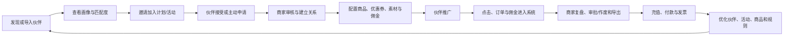
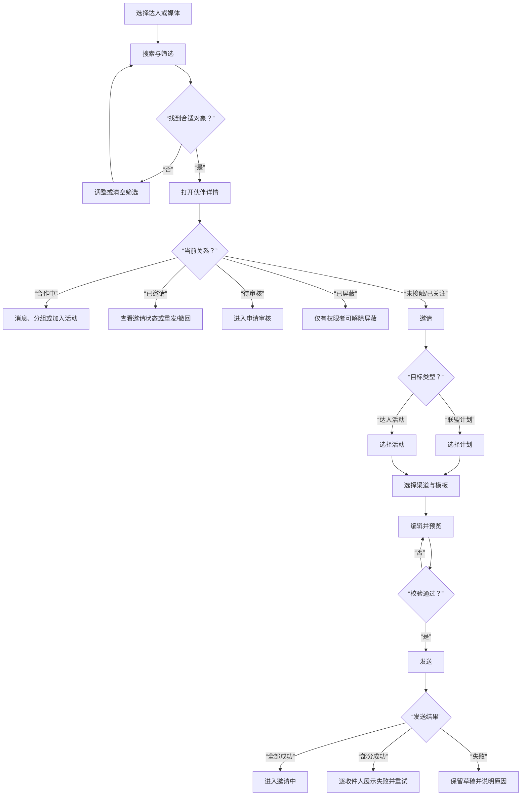
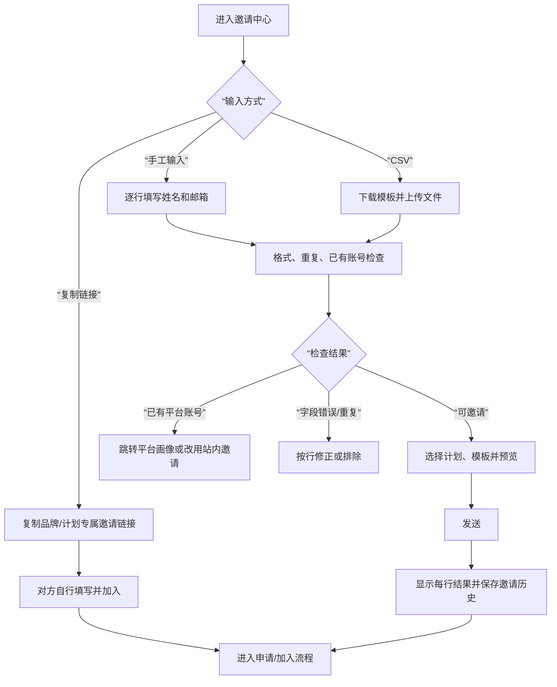
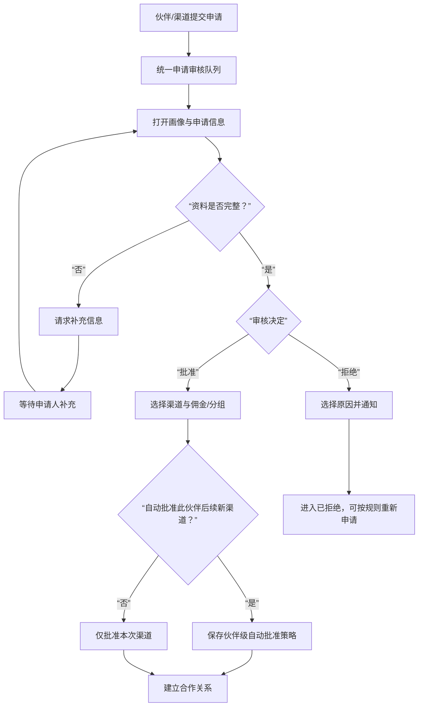
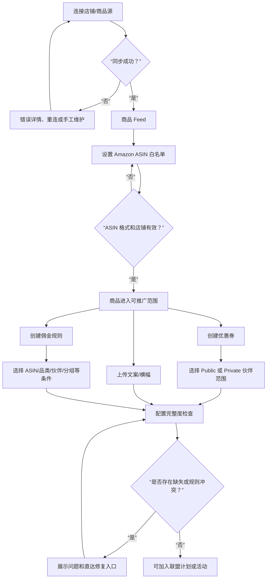
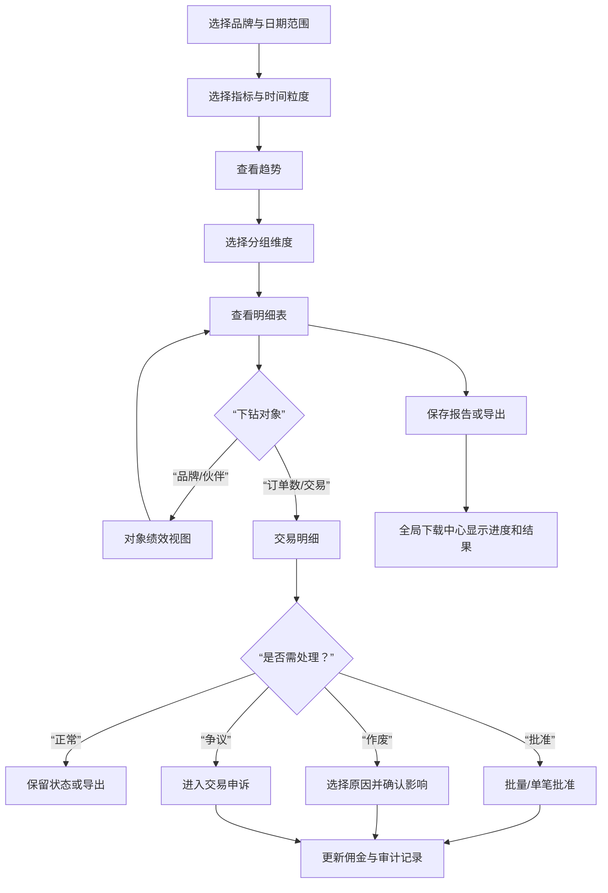
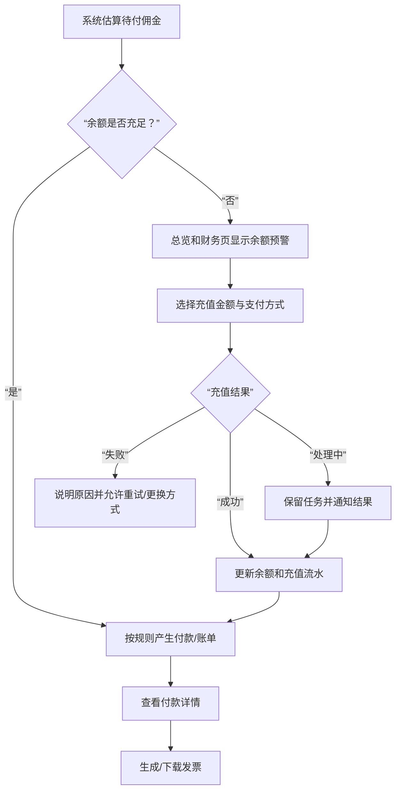
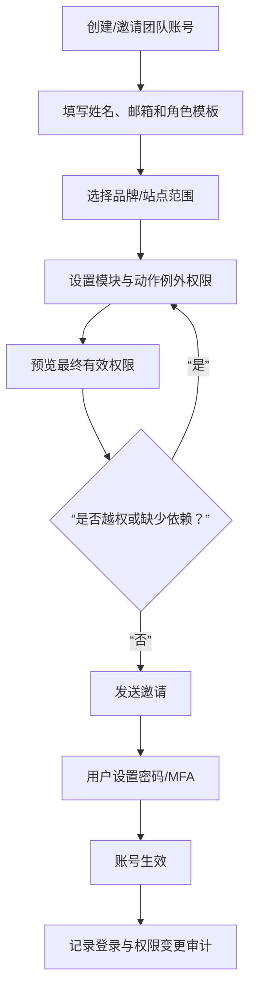

# 核心流程与分支

本文件描述站内对象如何跨栏目流动。视觉方案可以改变页面布局，但不得改变这些业务分支，除非先更新并重新确认框架。

## 1. 商家主闭环

### 入口

- 平台内搜索达人/媒体
- 对方主动申请
- 商家已知的站外联系人
- 活动内添加伙伴

### 闭环判定

至少完成“建立关系 → 可推广资产/规则齐备 → 有可追踪结果 → 可结算”，才算商家侧核心闭环。只完成“发现和发邀请”不是完整产品。

---

## 2. 平台内发现与邀请

### 必须确认的业务分支

- 同一伙伴是否允许同时加入多个联盟计划或达人活动。
- 已有未过期邀请时，系统是阻止、提醒还是允许覆盖。
- 邀请被拒绝后多久允许再次邀请。
- 商家关注是个人标记还是团队/品牌共享标记。
- 屏蔽的作用域是账号、品牌还是整个组织。

---

## 3. 站外联系人批量邀请

### 关键产品要求

- CSV 不是一次性黑箱上传；必须展示行级校验与部分成功。
- 真实姓名和邮箱属于敏感信息，上传历史按角色控制并支持保留期限。
- 系统邀请链接必须明确绑定的品牌、计划、佣金摘要、有效期和撤销方式。

---

## 4. 对方主动申请与人工审核

### 并发与审计

- 审核页显示当前负责人或锁定状态。
- 若其他管理员已处理，提交前提示状态变化而不是覆盖。
- 保存申请来源、审核人、时间、决定、原因、渠道、规则与自动批准变更。

---

## 5. 商品与推广配置

### 规则边界

- 商品的“手工维护”和自动同步发生冲突时必须定义优先级。
- 优惠券平台有效期与 Amazon 实际有效期可能不同，界面必须提示而不能承诺一致。
- 私有优惠券未选择伙伴时不能发布。
- 佣金规则保存前应显示命中范围与冲突结果；不能依赖管理员猜测优先级。

---

## 6. 绩效分析到交易处理

### 数据可信度要求

- 每个指标提供定义、币种、归因口径、数据源和刷新时间。
- Amazon BRB 的点击延迟等已知限制在视图内说明。
- 最后一天数据不完整时，不应画成“业绩突然下降”而不提示部分数据。
- 导出继承当前筛选、列和分组，并在导出任务中记录口径。

---

## 7. 财务与余额不足

### 权限要求

- 只读财务角色可查看和下载，不可充值或改变支付方式。
- 充值金额、支付方式变更和退款应使用更高权限，并记录审计。
- 付款详情中的伙伴、订单和金额根据品牌范围过滤。

---

## 8. 团队账号与权限

### 关键原则

- 管理员不应为其他用户创建并查看明文密码。
- 角色模板解决大多数情况，权限树只处理例外。
- 多品牌权限是“品牌范围 × 模块动作”，不是两套互不相关设置。
- 删除账号前说明其报告、模板、活动和待办如何转移。

---

## 9. Amazon 商家入驻、授权与商品启用

~~~mermaid
flowchart TD
    A["设置 / 品牌管理"] --> B["新增唯一网站名称与 URL"]
    B --> C{“启用确认成功？”}
    C -- “否” --> B
    C -- “是” --> D["切换到新站点"]
    D --> E["完善品牌资料"]
    E --> F["配置项目参数"]
    F --> G["开始站点授权"]
    G --> H["选择 CPS/CPI、Website/App、Tracking"]
    H --> I["选择 Amazon 区域"]
    I --> J{“授权流程变体”}
    J -- “指南 + URL” --> K["授权访问、粘贴首页 URL 并验证"]
    J -- “Profile + Storefront” --> L["选择 Profile 与首页"]
    K --> M["测试订单/完成"]
    L --> M
    M --> N{“授权在线？”}
    N -- “否” --> O["保留进度、显示原因并重试"] --> G
    N -- “是” --> P["配置 ASIN 名单"]
    P --> Q{“格式有效？”}
    Q -- “否” --> P
    Q -- “是” --> R["保存并等待自动同步"]
    R --> S{“同步成功？”}
    S -- “否” --> T["错误、重试、通知"] --> R
    S -- “是” --> U["产品库显示可推广商品"]
    U --> V["充值并确认余额/流水"]
~~~

### 授权版本边界

- 中文新版展示 Amazon 集成指南、授权后粘贴店铺首页 URL 并验证。
- 英文旧版展示 Profile ID/国家/名称选择，以及 Storefront 首页选择。
- 两者是账号类型或产品版本分支，不能默认连续执行；当前生产逻辑需业务确认。
- 进度条中的“测试订单”“完成”只有阶段证据，详细字段与成功标准不得凭空补写。

### 商品来源边界

- Amazon 来源商品以自动同步为权威。
- 增减可推广商品通过 Amazon 筛选规则修改 ASIN；不要从产品列表直接新增、编辑或删除。
- 截图要求 ASIN 以 B 开头且为 10 位字母数字；支持逗号/换行/回车分隔并按 Enter 验证。若支持其他合法 ASIN，需另行定义兼容范围。
- 名单每天自动更新；保存规则后先进入待同步，成功后才改变产品库状态。
- 白名单是手册推荐路径；黑名单是否保留及冲突优先级需业务确认。

### 财务启用分支

- 0 金额站点启用与真实账户充值分开记录和表述。
- 充值支持素材中展示的已保存银行卡、新银行卡、PayPal 与个人支付宝；实际可用方式按地区/账号配置。
- 第三方支付回跳与服务端通知必须幂等；失败、取消、过期和汇率变化均可恢复且不重复入账。
- 完整页面合同、字段、状态与验收见 [Amazon 商家入驻、站点授权与商品启用](07-amazon-merchant-onboarding-and-products.md)。

---

## 10. 通用失败与恢复分支

所有 P0 流程至少验证：

1. 初次进入没有数据。
2. 筛选后没有结果。
3. 页面或局部数据加载失败。
4. 表单字段错误与提交失败。
5. 批量操作部分成功。
6. 第三方同步延迟或断开。
7. 用户无查看或操作权限。
8. 对象在提交前被另一用户修改。
9. 长任务在离开页面后继续，并可从通知/下载中心恢复。
10. 成功后对象状态、计数、列表和详情保持一致。
