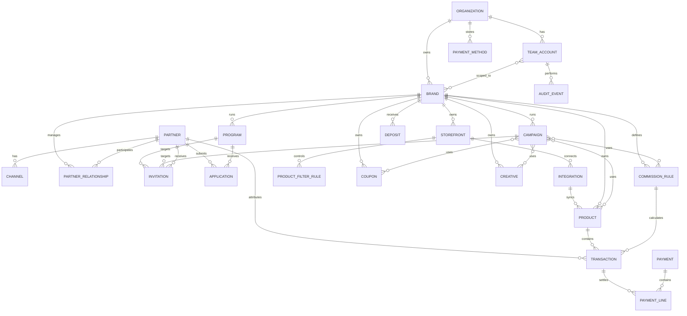
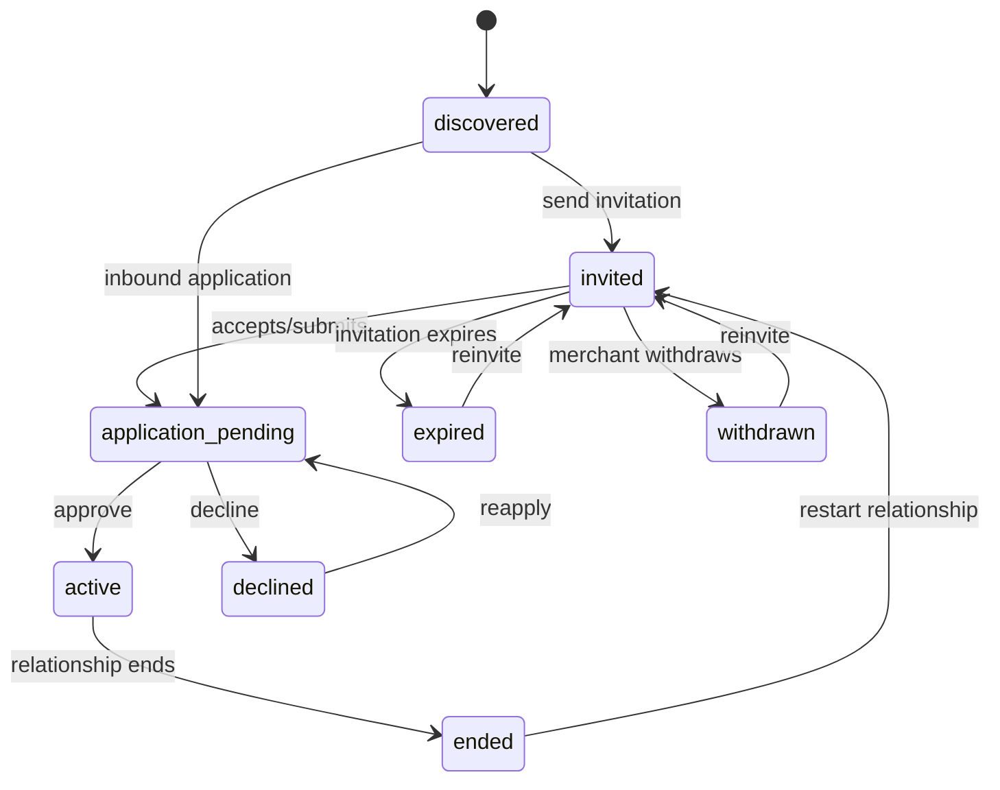
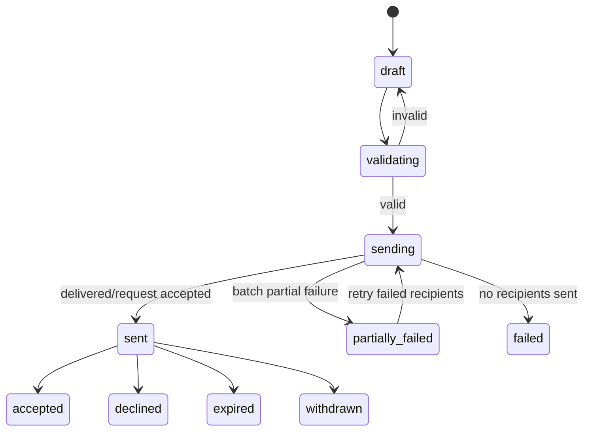
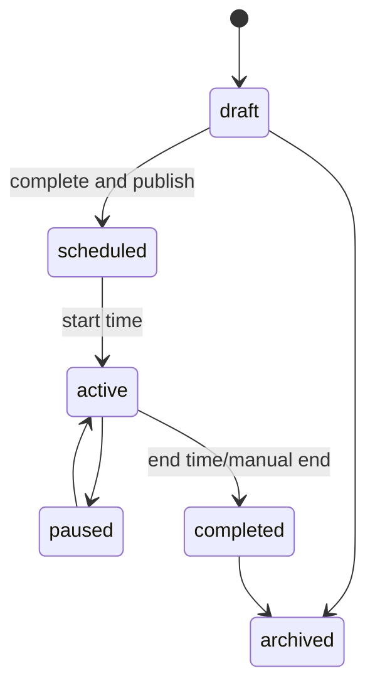

# 领域数据、状态与权限

## 1. 核心领域对象



## 2. 对象最低字段

### Organization

- organization_id、name、status
- default_currency、default_timezone
- created_at、updated_at

### Brand / Site

- brand_id、organization_id、name、logo
- sites / storefronts、marketplaces
- currency、timezone、locale
- integration_status、status

### Storefront / Integration

- storefront_id、brand_id、name、homepage_url、homepage_name
- provider（Amazon/Shopify/Shoplazza/WooCommerce/embedded/API）
- marketplace_region、country、currency、timezone
- integration_id、campaign_model、platform_type、tracking_provider
- external_profile_id（受保护）、profile_name
- authorization_status、verification_status、test_order_status
- connected_at、last_verified_at、last_synced_at、expires_at
- error_code、error_summary、recovery_action

### Product Filter Rule

- rule_id、brand_id、storefront_id
- list_type（whitelist / blacklist）
- asin_items（原始值、规范化值、验证状态、错误原因）
- status、pending_add_count、pending_remove_count
- saved_by、saved_at、last_sync_at、last_sync_result
- version、audit_events

### Team Account

- account_id、name、email/username
- status、role_template
- brand_scope、module_action_permissions
- mfa_status、last_login_at
- invited_by、created_at、updated_at

### Partner

- partner_id、partner_type（influencer / publisher / hybrid 待确认）
- display_name、avatar/logo、description
- countries、languages、categories、promotion_methods
- channels、profile_source、data_updated_at
- organization-wide block 标记（若业务支持）

### Channel

- channel_id、partner_id、type、platform
- url/handle、country/language、status
- followers/visits/ranks/engagement 等类型化指标
- joined_at、last_synced_at

### Partner Relationship

- relationship_id、brand_id、partner_id
- lifecycle_status、followed、blocked
- groups、default_commission_rule
- invited_at、joined_at、declined_at、ended_at
- owner、last_contact_at

### Invitation

- invitation_id、brand_id、partner/contact
- target_type、program_id/campaign_id
- selected_channels、template_version
- subject、body snapshot、invitation_link
- status、sent_by、sent_at、expires_at
- delivery/error details

### Application

- application_id、brand_id、partner_id、channel_ids
- source、message、submitted_at、status
- reviewer、reviewed_at、decision_reason
- auto_approve_future_channels

### Program / Campaign

- id、type、brand_id、name、objective、status
- owner、start_at、end_at
- partner scope、product/coupon/creative/rule links
- completeness and performance summary

### Product

- product_id、brand_id、storefront_id
- sku、asin、parent_asin、name、category
- old_price、current_price、availability
- source、manual_maintenance、last_synced_at、status

### Coupon

- coupon_id、brand_id、title、code、link
- description、category、restrictions
- image、thumbnail、permission
- partner/group scope、start_at、end_at、status

### Creative

- creative_id、brand_id、type、name
- content/file、language、alt_text、target_link
- campaign scope、partner scope、validity、status
- owner、updated_at

### Commission Rule

- rule_id、brand_id、name、model（CPS/CPI）
- rate、unit、start_at、end_at、description、status
- conditions、priority、conflict_summary、version

### Transaction

- transaction_id/order_id、brand_id、partner_id
- channel_id、product/SKU、quantity、country
- occurred_at、sales_amount、currency
- commission_rule_id/rate、commission_amount
- coupon、group、status、lock_state
- source、attribution identifiers

### Payment Method / Deposit / Payment / Invoice

- payment_method_id、organization_id、provider、type、display_label
- default、auto_pay_enabled、status、created_at、last_used_at
- 卡号仅保留支付服务商令牌、品牌和脱敏后四位；不保存 CVC
- deposit_id、brand_id、input_amount/currency、settlement_amount/currency
- exchange_rate/source/expires_at、fee、provider_reference
- payment_id、brand_id、method、type、description
- amount、currency、status、created_at、settled_at
- payment lines/order references、invoice_id/file_status

### Audit Event

- event_id、organization/brand scope
- actor、action、object_type、object_id
- before/after summary、reason、occurred_at
- request/source metadata（按隐私规范）

## 3. 伙伴状态契约

旧界面同时使用 `In Relationship / Joined / Followed / Invited / Pending / New Partners / Declined / Blocked`。建议拆成三个相互独立的维度，避免一个对象只能被塞进一个含混标签。

### 3.1 合作生命周期 `lifecycle_status`



建议 UI 文案：

| 内部状态 | 商家文案 | 说明 |
|---|---|---|
| discovered | 未接触 | 平台可发现，但没有关系动作 |
| invited | 已邀请 | 有进行中邀请 |
| application_pending | 待审核 | 对方已接受/主动申请，等待商家决定 |
| active | 合作中 | 已建立可推广关系；替代 In Relationship / Joined 双口径 |
| declined | 已拒绝 | 记录谁拒绝与原因 |
| expired | 邀请已过期 | 可再次邀请 |
| withdrawn | 已撤回 | 商家撤回邀请 |
| ended | 合作已结束 | 保留历史，不等同屏蔽 |

### 3.2 商家标记

- `followed: boolean`：收藏/关注，不改变合作生命周期。
- `blocked: boolean + scope + reason`：限制互动；可叠加在非 active 状态，active 时是否允许直接屏蔽需业务决定。
- `groups: []`：组织方式，不是关系状态。

### 3.3 渠道状态

- unreviewed、pending、approved、rejected、disabled
- 伙伴 active 不代表其每个新渠道自动 approved；由审核策略决定。

## 4. 邀请状态



**不可省略的信息：** 每个收件人的独立状态、最后尝试、失败原因、模板版本、邀请人和目标计划/活动。

## 5. 活动状态（建议，待业务确认）



- 配置不完整是 `completeness`，不应伪装成生命周期状态。
- 依赖缺失包括：无伙伴、无可推广商品/资产、无有效佣金规则、时间错误或集成断开。

## 6. 资产与规则状态

| 对象 | 建议状态 |
|---|---|
| Product | syncing、available、unavailable、excluded、error、archived |
| Coupon | draft、scheduled、active、expired、disabled、invalid |
| Creative | draft、published、withdrawn、expired、archived |
| Commission Rule | draft、scheduled、active、expired、disabled、superseded |
| Integration | not_started、configuring、awaiting_authorization、verifying、connected、test_pending、online、degraded、authorization_expired、failed、disconnected |
| Product Filter Rule | draft、validating、invalid、pending_sync、syncing、applied、partially_failed、failed |
| Storefront Onboarding | site_created、profile_incomplete、settings_incomplete、authorization_pending、product_sync_pending、funding_pending、ready、online |

状态必须配套原因、更新时间和可恢复动作，不能只给颜色。

## 7. 交易与财务状态

### Transaction

- estimated
- pending / locked
- approved
- paid
- voided
- disputed
- reversed/refunded（若支持）

状态变更需记录操作者、原因、影响佣金与关联付款。

### Payment / Deposit / Invoice

- deposit：draft、redirecting、pending、processing、succeeded、failed、cancelled、expired、refunded
- payment：pending、processing、paid/succeeded、failed、refunded/cancelled
- invoice：generating、ready、failed、void
- 外部支付回跳与 webhook 使用同一幂等键；只有服务端确认后更新余额
- 0 金额站点启用与真实充值使用不同对象或明确的 type

## 8. 角色模型（建议）

角色使用模板，品牌范围与少量例外权限叠加。

| 角色模板 | 典型职责 | 默认范围 |
|---|---|---|
| Organization Owner | 全组织治理、账单、安全与最终权限 | 所有品牌、所有模块 |
| Brand Admin | 管理指定品牌的伙伴、活动、资产、规则和团队 | 指定品牌；敏感财务/API 可选 |
| Partnership Manager | 发现、邀请、审核、伙伴和沟通 | 指定品牌的招募与伙伴 |
| Campaign Manager | 活动、资产、优惠券与执行 | 指定品牌的活动与资产 |
| Analyst | 报表、交易读取、保存报告与导出 | 指定品牌只读；交易修改默认关闭 |
| Finance | 余额、充值、付款、发票及必要交易明细 | 指定品牌财务；伙伴资料最小可见 |
| Developer | 集成、API、同步诊断 | 指定组织/品牌的技术设置 |
| Viewer | 被授权模块只读 | 指定品牌 |

## 9. 权限动作词表

每个模块不只使用“有/无权限”，至少区分：

- `view`
- `create`
- `edit`
- `delete/archive`
- `approve/reject`
- `export`
- `manage_sensitive`（充值、支付方式、凭证、账号权限等）

品牌范围与动作权限共同决定结果：

```text
有效权限 = 角色模板 ∩ 品牌/站点范围 + 明确例外 - 安全禁止项
```

## 10. 高风险动作与审计

以下动作至少需要确认、原因、操作者、时间和结果；部分应要求重新验证身份：

- 批准/拒绝伙伴或自动批准后续渠道
- 屏蔽伙伴、结束关系
- 删除商品/优惠券/素材、断开集成
- 改变佣金规则、规则优先级或追溯生效
- 批量批准/作废交易、添加人工交易
- 充值、退款、修改支付方式
- 创建/删除账号、扩大品牌或模块权限
- 创建、轮换或撤销 API 凭证
